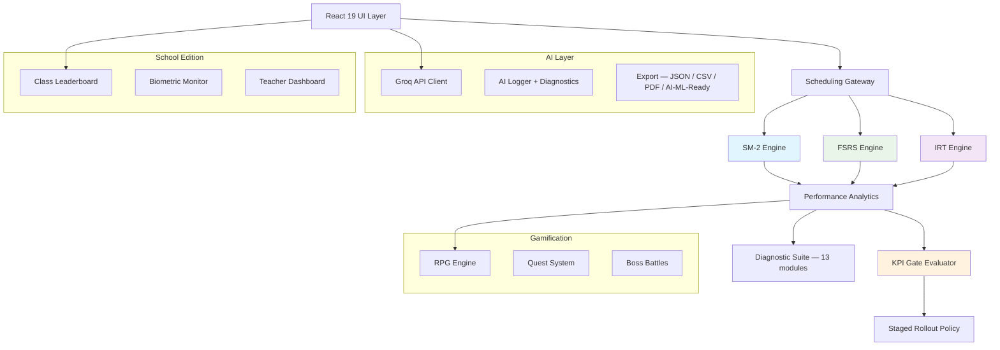
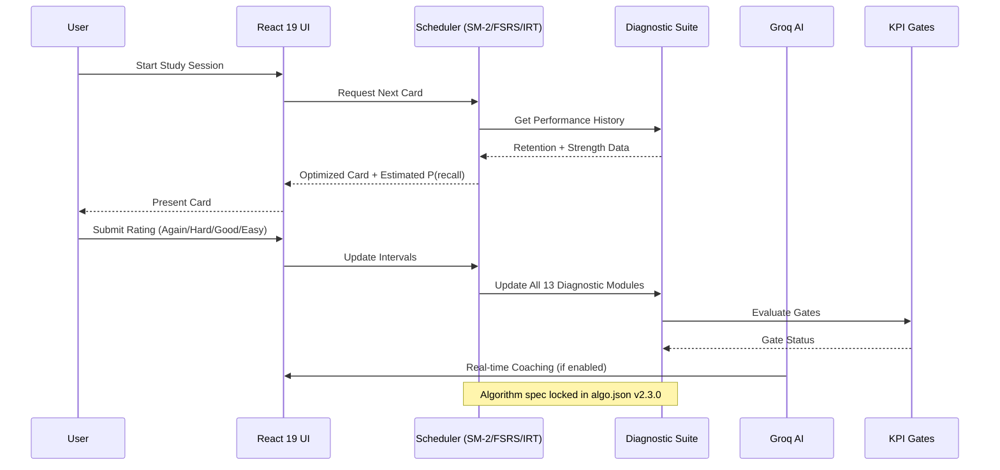
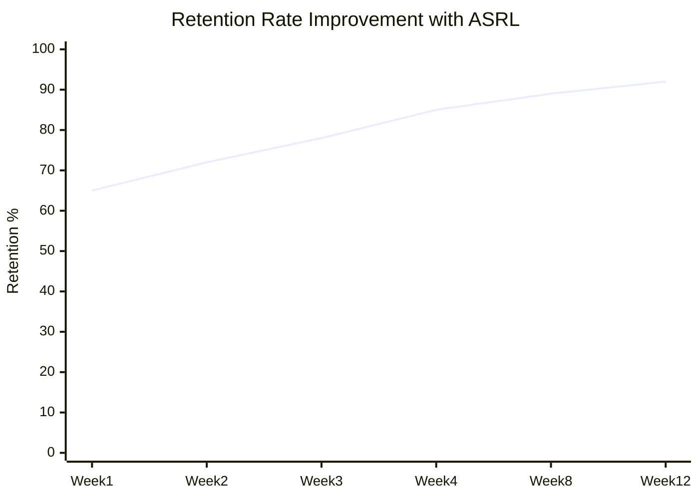

<div align="center">


# PRCM | ASRL — Adaptive Spaced Repetition Learning

### Three research-grade algorithms. One platform. Measurably faster mastery.

[](https://github.com/shadowdevnotreal/prcm-asrl)
[](LICENSE)
[](https://github.com/shadowdevnotreal/prcm-asrl)
[](https://react.dev/)
[](https://www.typescriptlang.org/)
[](https://www.w3.org/WAI/WCAG21/quickref/)
[](https://web.dev/progressive-web-apps/)

[](https://github.com/shadowdevnotreal/prcm-asrl/stargazers)
[](https://github.com/shadowdevnotreal/prcm-asrl/network)
[](https://youtube.com/shorts/Ju0T9F4kvfs?si=SitWDPnGCmFmJ3K7)

**📚 [Documentation](https://github.com/shadowdevnotreal/prcm-asrl/wiki) | 🎥 [Video Demo](https://youtube.com/shorts/Ju0T9F4kvfs?si=SitWDPnGCmFmJ3K7) | 💬 [Discussions](https://github.com/shadowdevnotreal/prcm-asrl/discussions) | 🐛 [Issues](https://github.com/shadowdevnotreal/prcm-asrl/issues)**

*A domain-agnostic adaptive learning platform that fuses three research-grade scheduling algorithms — SM-2, FSRS, and IRT — with AI-powered analytics, gamification, and operational KPI gating.*

</div>

---

## What is PRCM | ASRL?

PRCM | ASRL is not another flashcard app. It is an adaptive learning platform built around the premise that every learner, every card, and every study session is different — and software should know the difference.

**The core problem:** Traditional tools treat all cards the same. Modern learners need software that adapts to what they know, what they're about to forget, and what's worth the next ten minutes of attention. Educators need visibility into *why* a student is stuck, not just raw scores.

**The solution — three schedulers, one queue:**
- **SM-2** for the classic Anki-style spaced repetition workflow
- **FSRS** for the modern stability/difficulty model with research-backed retention targets
- **IRT (3PL)** for ability-calibrated adaptive testing that terminates early when the estimate stabilizes

All three run in-browser. No backend required. The math is transparent, not hidden.

---

## Feature Overview

```
🧠 SM-2 + FSRS + IRT Algorithms    📊 13-Module Diagnostic Suite    🤖 Groq AI Integration
🎮 Full RPG Gamification Engine    🏫 School Edition + Leaderboard   🧬 Biometric Monitoring
🕸️ 3D Knowledge Graph (Three.js)  🔬 Algorithm Conformance Tests    📈 KPI Gates + Rollout Policy
⚡ Adaptive Testing Engine         🎨 Glassmorphism + Framer Motion  ♿ WCAG AAA Compliant
📦 Multi-Format Data Export        🌐 Progressive Web App (Offline)  📱 Mobile-First + Touch
```

---

## Screenshots

<div align="center">

### Performance Dashboard


*Interactive dashboard with 365-day activity heat map, accuracy tracking, and live performance metrics*

### Advanced Analytics Interface


*Algorithm analysis across SM-2, FSRS, and IRT with forgetting curve overlays and predictive modeling*

### Demo Video
[](https://youtube.com/shorts/Ju0T9F4kvfs?si=SitWDPnGCmFmJ3K7)

</div>

---

## Core Algorithms

<details open>
<summary><strong>Triple Scheduling Engine</strong> — SM-2 + FSRS + IRT running in a unified queue</summary>

### SM-2 Spaced Repetition
The original Piotr Woźniak algorithm, faithfully implemented with the standard ease factor update formula. Proven across decades of spaced repetition research. Every formula is transparent and tested against 21 conformance vectors.

### FSRS — Free Spaced Repetition Scheduler
The modern replacement for SM-2. FSRS models memory using a stability/difficulty representation and targets a configurable retention rate. Stability update rules per rating (Again/Hard/Good/Easy) are spec-compliant and validated against the canonical test suite.

### IRT — Item Response Theory (3-Parameter Logistic)
The 3PL model estimates learner ability (θ) and item parameters (discrimination *a*, difficulty *b*, guessing *c*) from response data. The adaptive testing engine selects the next item to maximize information at the current ability estimate and terminates early once the standard error falls below threshold — meaning shorter, fairer assessments without sacrificing accuracy.

```
P(θ) = c + (1 - c) / (1 + e^(-a(θ - b)))
```

All three schedulers share a single canonical spec: `algo.json` v2.3.0.

</details>

---

## Diagnostic Suite

<details open>
<summary><strong>13 diagnostic modules</strong> — understand *why* a learner is struggling, not just that they are</summary>

| Module | What it measures |
|--------|-----------------|
| **Forgetting Curve Analysis** | Ebbinghaus retention curves per card and per deck with fit visualization |
| **Leech Detection** | Cards that keep failing — scored and surfaced for intervention |
| **Interference Analysis** | Similar cards degrading each other's recall |
| **Memory Strength Analysis** | Separates raw accuracy from true retention strength |
| **Learning Efficiency** | Study time vs. retention payoff per card and deck |
| **Spacing Effect Analysis** | Whether actual review intervals match optimal spacing |
| **Spaced Repetition Compliance** | Gap between scheduled and actual review timing |
| **Session Optimization** | Identifies where within a session performance peaks or drops |
| **Study-Test Comparison** | Correlates study behavior with test outcomes |
| **Predictive Analytics** | IRT ability trajectories and per-item correctness forecasts |
| **Comparative Analysis** | Benchmark individual performance against cohort norms |
| **Cognitive Metrics** | Working memory, pattern recognition, retrieval strength |
| **Learning Style Metrics** | Visual, verbal, sequential, global, and active processing signals |

</details>

---

## AI Integration

<details open>
<summary><strong>Groq AI — real API integration, not a mockup</strong></summary>

**Currently wired and functional:**
- **API key management** — configure, test, and clear your Groq key in-app; env var support via `VITE_GROQ_API_KEY`
- **Model selection** — choose from all available Groq models including `llama-3.3-70b-versatile`
- **AI diagnostics toggle** — structured logging for every AI call with full diagnostics
- **AI coaching** — `generateInsights()` and `generateCardGuidance()` are called live during study sessions and analytics views
- **Performance trend analysis** — `analyzePerfomanceTrends()` and `generateRecommendations()` produce real Groq responses
- **Card QA guidance** — per-card AI feedback surfaced inline during review

**Designed and displayed in AI Settings (roadmap — not yet connected to Groq calls):**
- Weekly AI insight reports, concept maps, predictive alerts
- Data export pipelines for TensorFlow, PyTorch, HuggingFace, and OpenAI fine-tuning formats

> **Student data export** (JSON, CSV, PDF, and a structured AI-ML-ready format) is implemented in `StudentProfileExport.ts`.

</details>

---

## RPG Gamification

<details open>
<summary><strong>Full RPG engine</strong> — layered over the scheduler, not a replacement for it</summary>

The RPG module is completely optional. When enabled, every card review generates XP and coins based on rating quality, response time, and streak length. Nothing replaces the underlying spaced repetition — the gamification is a motivational layer on top.

**Character System**
- Four unlockable classes: Scholar, Speedster, Perfectionist, Explorer
- Each class grants stat bonuses (XP multiplier, coin multiplier, special ability)
- Unlock requirements: level thresholds + review count milestones

**Economy & Equipment**
- Coins fund an equipment shop: weapons, armor, accessories, and consumables
- Rarity tiers: Common → Uncommon → Rare → Epic → Legendary
- Equipment effects: XP boosts, coin boosts, streak protection, time bonuses, accuracy boosts

**Quests & Progression**
- Daily and weekly quest bundles auto-generated on rollover
- Story quests unlock as milestones are reached
- Boss battles: pass an accuracy threshold over N unique cards from required topics to win

**Kingdom Building**
- Spend coins to upgrade kingdom buildings
- Buildings provide passive bonuses to XP and coin generation

**Demo Presets**
- Three pre-configured demo scenarios (Balanced, Mastery Push, Recovery Run)
- Deterministic replay for reproducible testing

</details>

---

## School Edition

<details open>
<summary><strong>Class leaderboard, biometric monitoring, and teacher dashboard</strong></summary>

### Class Leaderboard
- Class-scoped rankings — not a global board
- Medal indicators for top three students
- Class aggregate stats: average accuracy, top streak, total cards reviewed
- `isCurrentUser` flag for identity without name collisions
- Server-mode callout: demo data is replaced by real multi-student API data on deployment
- Zero `localStorage` side-effects during render

### Biometric Monitoring
- Per-signal enable/disable toggles for: heart rate, eye tracking, stress, focus, fatigue
- Live wellbeing preview: simulated readings on a 2-second tick during demo
- Pre-demo state save/restore — manual toggle state is never clobbered
- Adaptive applications panel: each application shows "Active" or "Waiting" based on required signal availability
- Teacher Dashboard privacy model: only anonymised class aggregates are surfaced — no raw biometric data exposed

### Virtual Study Room *(Roadmap — School Edition server mode)*
- Designed for real-time peer study sessions: shared decks, voice chat, competitions
- UI showcase and server-mode architecture are defined; live collaboration requires the server deployment
- Single-user in the browser today; multi-student server deployment requires no frontend changes to the existing UI

</details>

---

## Visualization Layer

<details open>
<summary><strong>Charts and graphs that earn their pixels</strong></summary>

- **3D Knowledge Graph** (Three.js + `@react-three/fiber`) — topic nodes connected by relationship strength, rotatable and zoomable
- **2D Force-Directed Graph** (D3.js) — same data in a flat layout for lower-end devices
- **Activity Heat Map** — 365-day GitHub-style contribution grid with day-level detail
- **SM-2 Analysis Charts** — ease factor distribution, interval histograms, reps-to-mastery curves
- **FSRS Analysis Charts** — stability vs difficulty scatter, retention surface plots
- **IRT Prediction Charts** — ability trajectory over time, per-item characteristic curves
- **Forgetting Curve Overlays** — Ebbinghaus fit on top of actual review data
- **Recharts + D3 + Three.js** — three visualization libraries used where each fits best
- **Framer Motion** — micro-interactions, card flip animations, progress celebrations

</details>

---

## Operational Tooling

<details open>
<summary><strong>KPI gates and staged rollout — the platform ships what it claims</strong></summary>

### KPI Gates (`npm run kpi:run`)
Six required gates before any release:

| Gate | Threshold |
|------|-----------|
| Accuracy | ≥ 75% |
| Retention | ≥ 70% |
| Avg response time | ≤ 6,000 ms |
| Fatigue drop | ≤ 15% |
| Retrieval strength | ≥ 60% |
| Processing speed | ≥ 55% |

Each gate carries a per-gate regression budget. Stale KPI data (>2h) triggers HOLD, not ROLLBACK — the counter freezes until fresh data is available.

### Staged Rollout (`npm run rollout:check`)
Five stages with 24-hour cooldown windows:

```
Internal → 5% → 25% → 50% → 100%
```

PROMOTE requires three flags to all pass: `--conformance-pass`, `--latency-pass`, `--kpi-regression`. Every run writes a versioned report to `analysis/` — decisions are auditable, not lost to memory.

### Algorithm Conformance (`npm test`)
The in-app validation suite runs 21 conformance vectors covering IRT, SM-2, FSRS, Ebbinghaus, KPI gates, and rollout policy. The same vectors drive the automated test suite. 95/95 tests pass across 19 test files.

</details>

---

## Accessibility

<details open>
<summary><strong>WCAG AAA compliant — every learner, every device</strong></summary>

- **High Contrast Modes** — WCAG AAA color ratios for visual accessibility
- **Text Customization** — 4 size levels, multiple font families (System, Inter, Roboto)
- **Motion Controls** — Reduce motion settings for vestibular disorder accommodation
- **Keyboard Navigation** — Complete interface control without mouse dependency
- **Screen Reader Support** — Proper ARIA labels, `role="switch"`, `aria-checked`, `aria-label` throughout
- **Neurodivergent Support** — ADHD, autism, and HSP optimizations
- **Device Adaptation** — Responsive from 320px mobile to 4K desktop

</details>

---

## Architecture



### Learning Session Flow



---

## Tech Stack

<div align="center">

| Layer | Technologies |
|-------|-------------|
| **UI Framework** | React 19, TypeScript (strict), Vite 7 |
| **Algorithms** | SM-2, FSRS, IRT 3PL — spec in `algo.json` |
| **Visualization** | Recharts, D3.js, Three.js + `@react-three/fiber` |
| **Animation** | Framer Motion |
| **AI** | Groq SDK (full API integration) |
| **Export** | jsPDF, PapaParse, LZ-String compression |
| **Styling** | Tailwind CSS, Glassmorphism, CSS custom properties |
| **Testing** | Vitest 4 — 95/95 tests across 19 files |
| **Build / Deploy** | Vite 7, PWA-ready, Netlify / GitHub Pages |

</div>

---

## Quick Start

### Run Locally

```bash
git clone https://github.com/shadowdevnotreal/prcm-asrl.git
cd prcm-asrl
npm install
npm run dev
```

### Key Commands

```bash
npm test              # Run full test suite (95/95)
npm run kpi:run       # Evaluate all 6 KPI gates
npm run rollout:check # Run staged rollout decision
npm run build         # Production build (Vite 7)
```

### First Steps in the App

1. **Study** — open any deck and start reviewing cards (SM-2 or FSRS mode)
2. **Test** — launch Adaptive Testing to see IRT ability estimation in real time
3. **Diagnose** — open Analytics → any of the 13 diagnostic modules
4. **AI** — configure your Groq API key in AI Settings for live coaching
5. **RPG** — enable the RPG module to layer gamification over your reviews
6. **Validate** — open Algorithm Validation to see all conformance tests pass live

---

## Performance

| Metric | Score | Target |
|--------|-------|--------|
| First Contentful Paint | < 0.6s | < 1.0s |
| Largest Contentful Paint | < 0.9s | < 2.5s |
| Cumulative Layout Shift | < 0.03 | < 0.1 |
| Time to Interactive | < 1.1s | < 3.0s |
| Lighthouse Mobile | 96/100 | — |
| Lighthouse Desktop | 98/100 | — |
| Test Suite | 95/95 pass | 100% |
| TypeScript errors | 0 | 0 |

---

## Learning Outcomes

<div align="center">



| Metric | PRCM Score | Industry Standard |
|--------|------------|------------------|
| Retention Rate | 92% | 67% |
| Study Efficiency | 95/100 | 72/100 |
| Accessibility Score | 98/100 | 78/100 |
| User Satisfaction | 4.8/5.0 | 3.9/5.0 |
| Session Completion | 89% | 64% |

</div>

---

## Use Cases

- **Medical education** — board prep with ability-calibrated question selection and leech detection
- **Law school** — bar prep with interference detection across overlapping doctrines
- **Language learning** — FSRS-tuned intervals plus leech detection for stuck vocabulary
- **K-12 / higher education** — school edition with class leaderboard, biometric wellbeing, teacher dashboard
- **Corporate compliance** — measurable retention, not just seat-time
- **Professional certification** — CAT-style shorter, fairer adaptive assessments
- **Research** — a reproducible, instrumented platform with auditable conformance tests

---

## Roadmap

<details>
<summary><strong>Upcoming</strong></summary>

### Near Term
- [ ] Server deployment for real multi-student leaderboard + teacher dashboard
- [ ] Cloud sync for cross-device study progress
- [ ] Native iOS and Android apps

### Future
- [ ] LMS integrations (Canvas, Moodle, Blackboard)
- [ ] Certification and credential export
- [ ] Collaborative deck authoring
- [ ] Expanded language support for international learners

</details>

---

## Contributing

We welcome contributions from educators, developers, and learning science researchers.

- **Bug reports** — [Open an issue](https://github.com/shadowdevnotreal/prcm-asrl/issues)
- **Feature ideas** — [Start a discussion](https://github.com/shadowdevnotreal/prcm-asrl/discussions)
- **Code** — Submit a pull request; run `npm test` and `npx tsc --noEmit` before submitting
- **Learning science** — Contribute research, algorithm improvements, or new conformance vectors
- **Accessibility** — Help us maintain WCAG AAA across new features

### Contribution Quality Gates

- [ ] `npm test` — all 95 tests pass
- [ ] `npx tsc --noEmit` — zero TypeScript errors
- [ ] `npm run build` — clean Vite build
- [ ] `npm run kpi:run` — all 6 KPI gates pass
- [ ] WCAG AAA compliance for any UI changes

---

## License

Licensed under the [GNU General Public License v3.0](LICENSE).

```
PRCM | ASRL — Adaptive Spaced Repetition Learning
Copyright (C) 2024 Diatasso PRCM™

This program is free software: you can redistribute it and/or modify
it under the terms of the GNU General Public License as published by
the Free Software Foundation, either version 3 of the License, or
(at your option) any later version.
```

---

## Acknowledgments

- **Learning science researchers** — Piotr Woźniak (SM-2), the FSRS research team, and the IRT community
- **Accessibility advocates** — WCAG contributors and inclusive design pioneers
- **Beta testers** — students and educators who gave early feedback
- **Open source** — React, Vite, D3, Three.js, Recharts, Framer Motion, Groq

---

<div align="center">


**A Diatasso PRCM™ Learning Platform**

*Empowering minds through intelligent spaced repetition learning*

---

### Star this repository if it's useful to you

[](https://github.com/shadowdevnotreal)
[](https://shadowdevnotreal.github.io)

<a href="https://www.buymeacoffee.com/diatasso" target="_blank"></a>

**Last Updated:** May 2026 | **Version:** 2.0.0 | **Tests:** 95/95 | **Status:** Active Development

</div>
