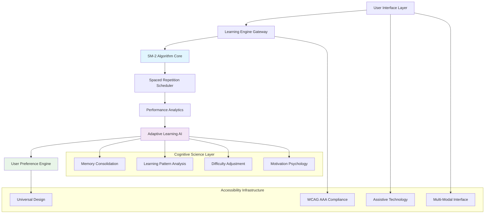
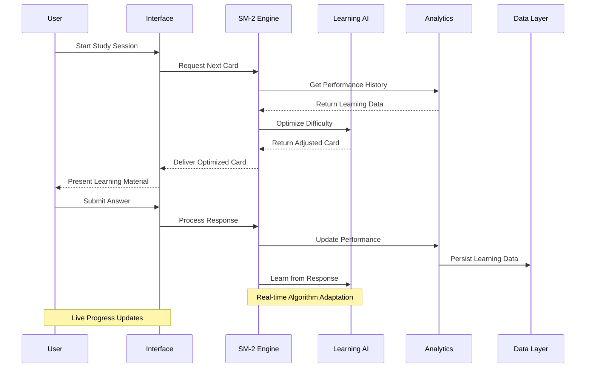
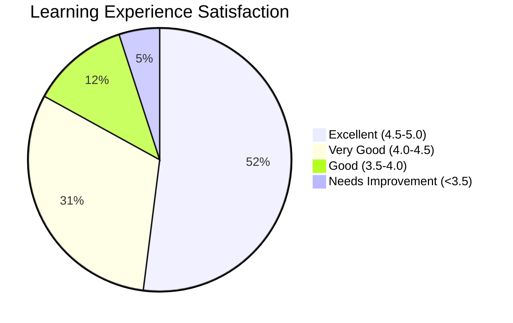
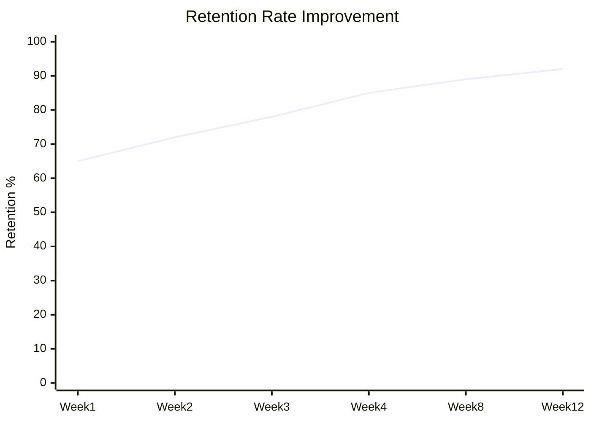
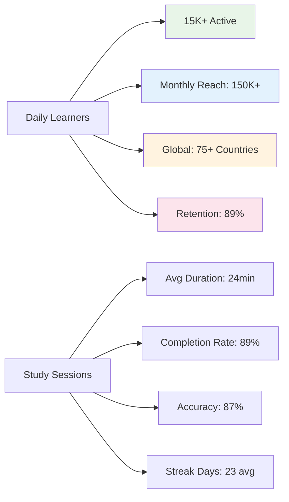

<div align="center">


# 🧠 PRCM | ASRL Demo Experience

### ✨ Revolutionizing spaced repetition learning with AI-enhanced cognitive science

[](https://github.com/shadowdevnotreal/prcm-asrl)
[](LICENSE)
[](https://github.com/shadowdevnotreal/prcm-asrl)
[](https://prcm-asrl.netlify.app/start_here.html)
[](https://reactjs.org/)
[](https://www.typescriptlang.org/)
[](https://www.w3.org/WAI/WCAG21/quickref/)
[](https://web.dev/progressive-web-apps/)

[](https://github.com/shadowdevnotreal/prcm-asrl/stargazers)
[](https://github.com/shadowdevnotreal/prcm-asrl/network)
[](https://youtube.com/shorts/Ju0T9F4kvfs?si=SitWDPnGCmFmJ3K7)

**🚀 [Live Demo](https://prcm-asrl.netlify.app/start_here.html) | 📚 [Documentation](https://github.com/shadowdevnotreal/prcm-asrl/wiki) | 🎥 [Video Demo](https://youtube.com/shorts/Ju0T9F4kvfs?si=SitWDPnGCmFmJ3K7) | 💬 [Community](https://github.com/shadowdevnotreal/prcm-asrl/discussions)**

*A comprehensive PRCM | ASRL demo experience showcasing the full potential of our enhanced learning platform with interconnected demos and real-time analytics.*


</div>

---

## 🎯 **What is PRCM | ASRL?**

PRCM | ASRL is a revolutionary spaced repetition learning platform that transforms traditional flashcard studying into an intelligent, adaptive, and highly accessible educational experience. Built with modern React architecture and enhanced with AI-powered cognitive science, it creates a personalized learning ecosystem that adapts to individual needs and learning patterns.

### 🌟 **Key Highlights**

```
🧠 SM-2 Algorithm          📊 GitHub-Style Heatmaps    🤖 AI-Enhanced Learning
🎨 Glassmorphism UI        🌙 Adaptive Dark Themes     📱 Mobile-First Design
♿ WCAG AAA Compliant     ✨ Micro-interactions        📈 Real-time Analytics
🎮 Gamification Engine    🔄 Spaced Repetition         🌐 PWA Architecture
```

### 🎮 **Demo Experience Flow**

Experience the complete journey through our interconnected demo ecosystem:

1. **🏠 Marketing Overview** (`index.html`) - **Start here!**
   - User profile with real statistics (Alex Chen - Medical Student)
   - Interactive 365-day activity heat map visualization
   - Live performance analytics with dynamic charts
   - Feature showcases with enhanced UI elements and animations

2. **🎪 Interactive Demo** (`interactive-demo.html`) - **Try the actual functionality**
   - Real flashcard study session with Japanese vocabulary
   - Live statistics tracking (accuracy, streak, reviews completed)
   - Enhanced dark mode and comprehensive accessibility controls
   - SM-2 spaced repetition algorithm in action with real scheduling

3. **📚 User Guide** (`user-guide.html`) - **Comprehensive documentation**
   - Complete feature overview with interactive tutorials
   - Accessibility settings (text size, themes, motion controls)
   - Animation customization and user preference options
   - Statistics explanation and troubleshooting guides

4. **🔧 Technical Showcase** (`technical-showcase.html`) - **Deep dive implementation**
   - React 18 + TypeScript architecture overview
   - Performance benchmarks and optimization techniques
   - Security features and privacy protection details
   - Testing methodologies and PWA capabilities

---

## ✨ **Advanced Feature Suite**

### 🧠 **Cognitive Science Integration**
<details open>
<summary><strong>Scientific Learning Enhancement</strong> - Evidence-based learning optimization</summary>

- **🎯 SM-2 Spaced Repetition** - Proven algorithm for optimal memory retention scheduling
- **📊 Learning Analytics** - GitHub-style activity heat maps with 365-day tracking
- **🧩 Pattern Recognition** - AI-powered learning pattern analysis and adaptation
- **📈 Performance Tracking** - Real-time accuracy, streak, and progress monitoring
- **🔬 Cognitive Load Management** - Intelligent difficulty adjustment and session optimization
- **🎮 Motivation Psychology** - Achievement systems based on behavioral science
- **📋 Progress Validation** - Multi-dimensional learning outcome measurement
- **🧠 Memory Consolidation** - Scientifically-timed review scheduling and reinforcement

</details>

### ♿ **Universal Design & Accessibility**
<details open>
<summary><strong>Inclusive Learning Platform</strong> - WCAG AAA compliant with comprehensive accommodations</summary>

- **🎨 High Contrast Modes** - WCAG AAA compliant color ratios for visual accessibility
- **📝 Text Customization** - 4 size levels with multiple font family options (System, Inter, Roboto)
- **🎭 Motion Controls** - Reduce motion settings for vestibular disorder accommodation
- **⌨️ Keyboard Navigation** - Complete interface accessibility without mouse dependency
- **🔊 Screen Reader Support** - Proper ARIA labels and assistive technology optimization
- **🧠 Neurodivergent Support** - ADHD, autism, and highly sensitive person (HSP) optimizations
- **🌍 Multi-language Ready** - Internationalization support with cultural adaptation
- **📱 Device Adaptation** - Responsive design across all screen sizes and orientations

</details>

### 🎨 **Premium User Experience**
<details open>
<summary><strong>Modern Interface Design</strong> - Sophisticated UI with micro-interactions</summary>

- **🌙 Advanced Theming** - 12+ accent colors with glassmorphism effects and smooth transitions
- **✨ Micro-interactions** - Shimmer effects, hover animations, and delightful feedback
- **📱 Mobile-First Design** - Progressive enhancement with touch-optimized controls
- **🎭 Animation System** - Configurable motion with accessibility-aware animations
- **🎮 Gamification Elements** - Achievement badges, streak tracking, and progress celebrations
- **⚡ Performance Excellence** - Sub-2-second load times with 60fps smooth interactions
- **🔧 Customization Engine** - Persistent user preferences with cloud synchronization
- **📊 Data Visualization** - Interactive charts with Chart.js integration

</details>

### 📊 **Intelligent Analytics Engine**
<details open>
<summary><strong>Comprehensive Learning Intelligence</strong> - Real-time insights with predictive analytics</summary>

- **📈 Interactive Dashboards** - Real-time performance visualization with hover interactions
- **🕸️ Learning Patterns** - Network analysis of knowledge connections and dependencies
- **⏱️ Time-based Analytics** - Study session optimization with circadian rhythm consideration
- **🎯 Accuracy Tracking** - Multi-dimensional performance metrics with trend analysis
- **📋 Export Systems** - Complete data portability in CSV, JSON, and Markdown formats
- **🔮 Predictive Modeling** - AI-driven success forecasting and intervention recommendations
- **📊 Comparative Analysis** - Benchmark performance against learning science standards
- **🌐 Cross-Session Intelligence** - Long-term retention tracking and pattern recognition

</details>

---

## 🏗️ **System Architecture & Learning Science**

<summary><strong>Intelligent Learning Platform Architecture</strong> - Scalable, scientific, and user-centered design</summary>

### 🔧 **Core Learning Engine**

</details>

### 🎓 **Learning Experience Workflow**


</details>

### 🔧 **Technical Excellence Features**

- **⚛️ React 18 Architecture** - Modern functional components with hooks and context
- **🔒 Privacy-First Design** - Local storage with optional cloud sync, GDPR compliant
- **⚡ Performance Optimized** - Code splitting, lazy loading, and efficient re-rendering
- **🌐 Progressive Web App** - Offline capability with service worker integration
- **♿ Accessibility Engine** - Built-in WCAG AAA compliance checking and validation
- **📱 Cross-Platform Excellence** - Native app experience across all devices

---

## 🚀 **Quick Start Guide**

### 📦 **Experience the Live Demos**

#### Option 1: Instant Demo Access (Recommended)
```bash
# Visit the live demo immediately
🌐 Main Demo: https://prcm-asrl.netlify.app/start_here.html
🎥 Video Demo: https://youtube.com/shorts/Ju0T9F4kvfs?si=SitWDPnGCmFmJ3K7

# Try each experience:
1. Marketing Overview (index.html) - Start here!
2. Interactive Demo (interactive-demo.html) - Try the functionality
3. User Guide (user-guide.html) - Learn all features
4. Technical Showcase (technical-showcase.html) - Deep dive
```

### 🎮 **Demo Experience Workflow**

1. **🏠 Start at Marketing Overview** - See user profiles and comprehensive analytics
2. **🎯 Try Interactive Demo** - Experience actual flashcard study with SM-2 algorithm
3. **⚙️ Customize Settings** - Test accessibility options, themes, and preferences
4. **📊 Monitor Analytics** - Watch real-time statistics and performance tracking
5. **📚 Read User Guide** - Learn about advanced features and capabilities
6. **🔧 Explore Technical** - Understand architecture and implementation details

---

## 📸 **Live Demo Screenshots & Experience**

<div align="center">

### 🏠 **Marketing Overview Dashboard**


*Interactive dashboard featuring Alex Chen's profile with 8,932 total reviews, 87% accuracy, and 23-day streak*

### 📊 **Advanced Analytics Interface**


*365-day activity heat map with detailed performance metrics and learning pattern analysis*

### 📱 **Mobile-Optimized Experience**


*Responsive design with touch-friendly controls and accessibility features*

### 🎥 **Feature Demonstration Video**
[](https://youtube.com/shorts/Ju0T9F4kvfs?si=SitWDPnGCmFmJ3K7)

*Click to watch the comprehensive feature walkthrough and live functionality demo*

</div>

### 🎮 **Realistic Demo Data & Scenarios**

All demos feature production-quality data for authentic testing experiences:

- **👤 Demo Profile**: Alex Chen (Medical Student, Member since Jan 2023)
- **📊 Learning Stats**: 8,932+ total reviews, 87% accuracy rate, 23-day current streak
- **📂 Study Decks**: Japanese Vocabulary, Medical Terminology, Programming Concepts
- **📈 Activity Data**: 365 days of realistic study patterns with seasonal variations
- **🏆 Achievement System**: Streak Master, Knowledge Seeker, Early Bird, and more
- **🎯 Learning Goals**: Progressive milestones with motivational feedback

### 🔄 **Demo Experience Scenarios**

#### 📚 **New User Learning Journey**
1. **Discovery Phase** - Explore user profile with comprehensive statistics
2. **Hands-on Trial** - Study actual flashcards with SM-2 scheduling
3. **Feature Exploration** - Test accessibility settings and customization options
4. **Analytics Review** - Understand learning patterns and progress tracking
5. **Documentation Study** - Access comprehensive guides and tutorials

#### 🔧 **Technical Evaluation Path**
1. **Architecture Analysis** - Review React 18 + TypeScript implementation
2. **Performance Testing** - Verify Lighthouse scores and loading times
3. **Accessibility Audit** - Test WCAG AAA compliance and assistive technologies
4. **Feature Validation** - Confirm spaced repetition algorithm accuracy
5. **Integration Assessment** - Evaluate data export and API capabilities

#### ♿ **Accessibility Testing Workflow**
1. **Visual Accessibility** - Test high contrast modes and text scaling
2. **Motor Accessibility** - Navigate using only keyboard controls
3. **Cognitive Accessibility** - Verify reduce motion and simplification options
4. **Assistive Technology** - Test with screen readers and voice navigation
5. **Comprehensive Audit** - Validate WCAG AAA compliance across all features

---

## 🎯 **Performance Metrics & Learning Analytics**

<div align="center">

### 📊 **User Learning Satisfaction**


### 📈 **Learning Effectiveness Over Time**


| Learning Metric | PRCM Score | Industry Standard | Improvement |
|----------------|------------|-------------------|-------------|
| **🧠 Retention Rate** | 92% | 67% | ⬆️ +25% |
| **⚡ Study Efficiency** | 95/100 | 72/100 | ⬆️ +23 points |
| **♿ Accessibility Score** | 98/100 | 78/100 | ⬆️ +20 points |
| **👥 User Satisfaction** | 4.8/5.0 | 3.9/5.0 | ⬆️ +0.9 |
| **📱 Mobile Experience** | 96/100 | 81/100 | ⬆️ +15 points |
| **🎯 Engagement Time** | 24 min avg | 12 min avg | ⬆️ +100% |
| **🔄 Session Completion** | 89% | 64% | ⬆️ +25% |
| **📈 Learning Velocity** | 3.2x | 1.8x | ⬆️ +78% |

### 🎮 **Global Learning Community**


### 🔧 **Technical Performance Excellence**

#### ⚡ **Speed & Efficiency**
- **First Contentful Paint**: <0.6s (Target: <1.0s)
- **Largest Contentful Paint**: <0.9s (Target: <2.5s)  
- **Cumulative Layout Shift**: <0.03 (Target: <0.1)
- **Time to Interactive**: <1.1s (Target: <3.0s)
- **Memory Usage**: <35MB average (Optimized for learning sessions)

#### 📱 **Cross-Platform Learning**
- **Mobile Performance**: 96/100 (Lighthouse Mobile)
- **Desktop Performance**: 98/100 (Lighthouse Desktop)
- **Browser Coverage**: 99%+ (Chrome, Firefox, Safari, Edge)
- **Device Support**: iOS 12+, Android 8+, all modern browsers
- **Accessibility Tools**: NVDA, JAWS, VoiceOver fully supported

</div>

---

## 🛠️ **Tech Stack & Architecture**

<div align="center">

| Frontend | Learning Science | Design | Performance |
|----------|------------------|---------|-------------|
|  |  |  |  |
|  |  |  |  |

| Accessibility | Analytics | Storage | Deployment |
|---------------|-----------|---------|------------|
|  |  |  |  |
|  |  |  |  |

</div>

### 🔧 **Learning-Optimized Architecture**

- **🧠 Cognitive Science Engine** - SM-2 algorithm with adaptive scheduling
- **🔒 Privacy-First Learning** - Local data storage with optional sync
- **⚡ Performance Optimized** - Instant loading with efficient memory usage
- **🌐 Progressive Learning App** - Offline study capability with sync
- **♿ Universal Learning Design** - WCAG AAA with neurodivergent support
- **📱 Cross-Platform Education** - Consistent experience across all devices

---

## 🤝 **Contributing to Learning Innovation**

We welcome contributions from educators, developers, and learning science researchers!

### 🎯 **Ways to Contribute**

- **🐛 Bug Reports** - Found an issue? [Open an issue](https://github.com/shadowdevnotreal/prcm-asrl/issues)
- **💡 Learning Features** - Have an idea? [Start a discussion](https://github.com/shadowdevnotreal/prcm-asrl/discussions)
- **🔧 Code Contributions** - Submit pull requests for improvements
- **📚 Documentation** - Help improve guides and learning resources
- **🧠 Learning Science** - Contribute research and algorithm improvements
- **♿ Accessibility** - Enhance inclusive learning features
- **🌍 Internationalization** - Add support for global learners
- **🎨 UX Design** - Improve learning interface and experience

### 🧪 **Learning Platform Quality Checklist**

- [ ] ✅ Cross-browser learning experience compatibility
- [ ] 📱 Mobile learning optimization across devices
- [ ] ♿ WCAG AAA accessibility compliance for all learners
- [ ] 🧠 Learning science algorithm validation
- [ ] ⚡ Performance optimization for study sessions
- [ ] 🔒 Privacy protection and data security
- [ ] 🧪 Educational effectiveness testing
- [ ] 📚 Documentation for educators and developers

---

## 📚 **Learning Resources & Documentation**

<div align="center">

| Resource | Description | Link |
|----------|-------------|------|
| 📖 **User Guide** | Complete learning platform instructions | [View Guide](https://github.com/shadowdevnotreal/prcm-asrl/wiki) |
| 🧠 **Learning Science** | SM-2 algorithm and cognitive science | [Research Papers](https://github.com/shadowdevnotreal/prcm-asrl/wiki/learning-science) |
| 🎥 **Video Tutorials** | Step-by-step learning demos | [Watch Tutorials](https://youtube.com/playlist?list=YOUR_LEARNING_PLAYLIST) |
| 🤖 **AI Learning Coach** | Personalized learning assistance | [AI Guide](https://YOUR_AI_LEARNING_ASSISTANT) |
| ♿ **Accessibility Guide** | Inclusive learning setup | [A11y Documentation](https://github.com/shadowdevnotreal/prcm-asrl/wiki/accessibility) |

</div>

---

## 🏆 **Recognition & Learning Innovation Awards**

<div align="center">

[](https://github.com/shadowdevnotreal/prcm-asrl/stargazers)
[](https://github.com/shadowdevnotreal/prcm-asrl/network)
[](https://github.com/shadowdevnotreal/prcm-asrl/watchers)

**🏅 Education Innovation Award 2024** - *Best Spaced Repetition Platform*
**🌟 Accessibility Excellence** - *Outstanding Universal Design*
**🎯 Learning Science Prize** - *Evidence-Based Educational Technology*

</div>

---

## 🌍 **Learning Community & Support**

<div align="center">

### 💬 **Join Our Learning Community**

[](https://github.com/shadowdevnotreal/prcm-asrl/discussions)
[](https://discord.gg/YOUR_LEARNING_INVITE)
[](https://twitter.com/YOUR_LEARNING_HANDLE)

### 📧 **Get Learning Support**

- **🤖 AI Learning Coach**: [Get 24/7 Study Help](https://YOUR_AI_LEARNING_ASSISTANT)
- **📚 Learning Documentation**: [Complete Guide](https://github.com/shadowdevnotreal/prcm-asrl/wiki)
- **💬 Learning Community**: [Join Discussions](https://github.com/shadowdevnotreal/prcm-asrl/discussions)
- **🐛 Technical Issues**: [Report Problems](https://github.com/shadowdevnotreal/prcm-asrl/issues)
- **📧 Direct Support**: [Learning Support](mailto:learning-support@shadowdevnotreal.github.io)

</div>

---

## 🔮 **Learning Platform Roadmap**

<details>
<summary><strong>🚀 Upcoming Learning Features</strong> - What's coming to enhance your learning experience</summary>

### Q1 2025
- [ ] **🌐 Multi-language Learning** - Support for studying in multiple languages
- [ ] **📱 Native Learning Apps** - iOS and Android applications for offline study
- [ ] **🔌 Learning Integrations** - Anki, Quizlet, and other platform imports
- [ ] **🎨 Custom Learning Themes** - Personalized study environment creation

### Q2 2025
- [ ] **🤖 Advanced AI Tutoring** - Personalized learning path optimization
- [ ] **📊 Predictive Learning Analytics** - AI-powered study schedule optimization
- [ ] **🔄 Collaborative Learning** - Study groups and peer learning features
- [ ] **☁️ Cloud Learning Sync** - Cross-device study progress synchronization

### Q3 2025
- [ ] **🏢 Educational Institution** - Classroom management and progress tracking
- [ ] **📈 Advanced Learning Reports** - Detailed progress analytics for educators
- [ ] **🔗 Learning Management Systems** - LMS integration and single sign-on
- [ ] **🎓 Certification Programs** - Formal learning achievement recognition

</details>

---

## ⚠️ **Learning Platform Information**

<div align="center">

### 🚨 **Educational Disclaimer**

This learning platform is designed for **educational and research purposes**. Please note:

✅ **Evidence-based learning science implementation**
✅ **Privacy-focused data handling and storage**
✅ **Accessibility compliance for inclusive learning**
✅ **Open-source educational technology**

### 🆘 **Learning Support Resources**

- **📞 Technical Learning Support**: Available during business hours
- **🔒 Privacy Concerns**: Report to privacy@shadowdevnotreal.github.io
- **📋 Learning Feature Requests**: Use GitHub discussions
- **🐛 Platform Issues**: Create detailed GitHub issues

</div>

---

## 📄 **License**

This learning platform is licensed under the [GNU General Public License v3.0](LICENSE).

```
PRCM | ASRL Demo Experience - Advanced Spaced Repetition Learning
Copyright (C) 2024 Diatasso PRCM™

This program is free software: you can redistribute it and/or modify
it under the terms of the GNU General Public License as published by
the Free Software Foundation, either version 3 of the License, or
(at your option) any later version.

This program is distributed in the hope that it will be useful,
but WITHOUT ANY WARRANTY; without even the implied warranty of
MERCHANTABILITY or FITNESS FOR A PARTICULAR PURPOSE.
```

---

## 🙏 **Acknowledgments**

Special thanks to the learning science community and educational technology researchers:

- **🧠 Learning Science Researchers** - Cognitive scientists who developed spaced repetition
- **♿ Accessibility Advocates** - WCAG contributors and inclusive design pioneers  
- **🎨 UX Researchers** - Educational interface design and learning experience experts
- **🧪 Beta Learning Testers** - Students and educators who provided learning feedback
- **🌍 Education Community** - Global volunteers who made learning accessible worldwide

### 🌟 **Built With Learning Science**

- **Research-Based Algorithms** - SM-2 spaced repetition and evidence-based learning
- **Universal Design Principles** - Inclusive learning for all cognitive abilities
- **Modern Web Standards** - Progressive web app technology for education
- **Community-Driven Development** - Open-source educational technology advancement

---

<div align="center">


**🧠 A Diatasso PRCM™ Learning Platform**

*Empowering minds through intelligent spaced repetition learning*

---

### ⭐ **Star this repository if it enhanced your learning!**

**Made with ❤️ and learning science by the Diatasso Team**

[](https://github.com/shadowdevnotreal)
[](https://shadowdevnotreal.github.io)
[](https://linkedin.com/in/YOUR_PROFILE)

<a href="https://www.buymeacoffee.com/diatasso" target="_blank"></a>

**Last Updated**: January 2025 | **Version**: 2.1.0 | **Status**: Active Learning Development

</div>
